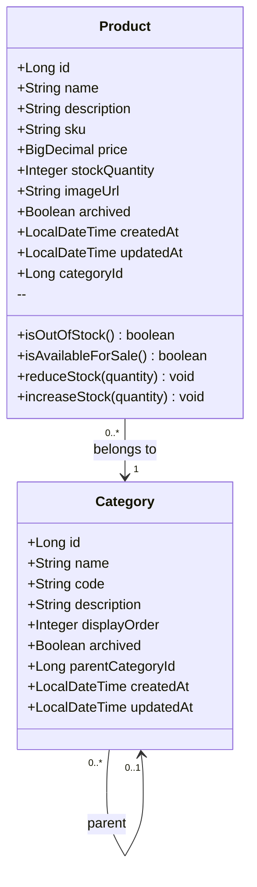
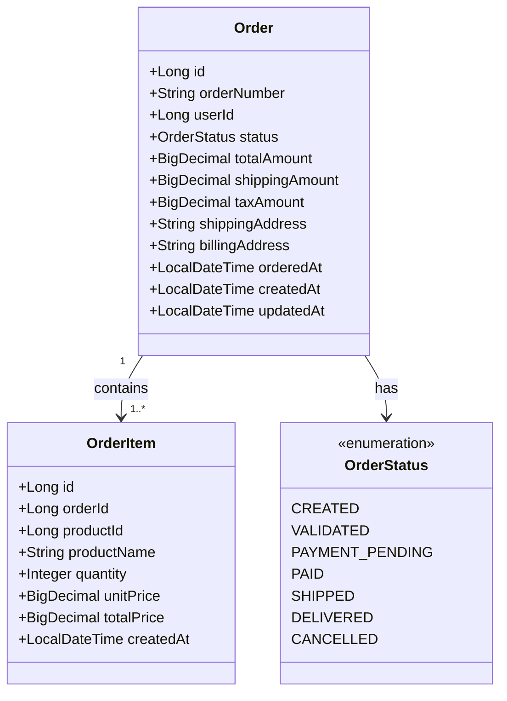
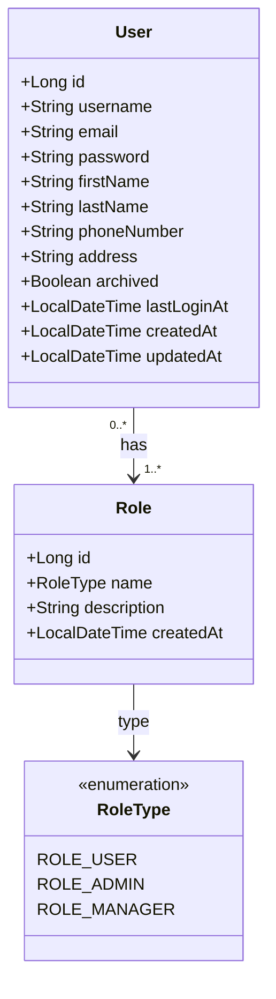
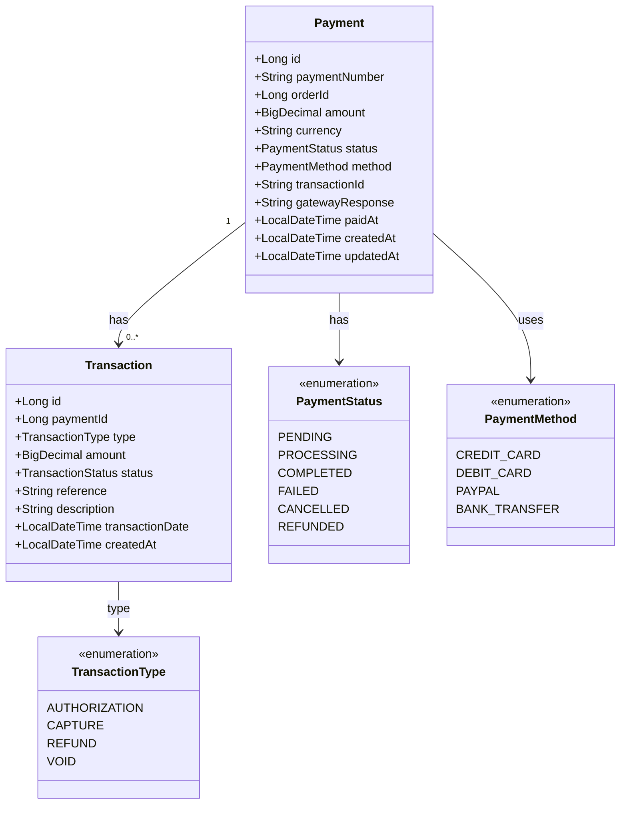

# Modèle de Données - Plateforme E-Commerce (Essentiel)

> 💡 **Version simplifiée avec diagrammes de classes**. Voir `conception.md` pour schémas SQL complets, contraintes et index.

---

## 🏗️ Répartition par Service

Chaque microservice a sa propre base de données (principe d'isolation).

```
Service Catalogue    → DB catalogue_db
Service Commandes    → DB orders_db
Service Utilisateurs → DB users_db
Service Paiement     → DB payments_db
```

---

## 📦 Service Catalogue

### Diagramme de Classes



### Précisions sur les Attributs

**Product** :
- `sku` : Stock Keeping Unit, **unique** et obligatoire
- `price` : Prix unitaire, doit être **>= 0**
- `stockQuantity` : Quantité disponible, doit être **>= 0**
- `archived` : Si `true`, le produit n'est plus visible dans le catalogue
- `categoryId` : Référence vers Category (clé étrangère)

**Category** :
- `code` : Code technique **unique** (ex: "ELECTRONICS", "CLOTHING")
- `displayOrder` : Ordre d'affichage dans l'interface (0 = premier)
- `parentCategoryId` : Permet une hiérarchie de catégories (nullable pour catégories racines)

**Méthodes Métier** :
- `isOutOfStock()` : Retourne `true` si `stockQuantity` est null ou <= 0
- `isAvailableForSale()` : Retourne `true` si `archived=false` ET `!isOutOfStock()`
- `reduceStock(quantity)` : Diminue le stock, lève exception si quantité insuffisante
- `increaseStock(quantity)` : Augmente le stock, initialise à 0 si null

---

## 🛒 Service Commandes

### Diagramme de Classes



### Précisions sur les Attributs

**Order** :
- `orderNumber` : Numéro de commande **unique** (ex: "ORD-2025-00001")
- `userId` : Référence l'utilisateur (pas de FK directe entre bases !)
- `status` : Énumération suivant le workflow de commande
- `totalAmount` : **Calcul** = sum(orderItems.totalPrice) + shippingAmount + taxAmount
- `shippingAddress` / `billingAddress` : Stockées en texte libre (snapshot)

**OrderItem** :
- `productId` : Référence au produit (pas de FK, juste ID pour appel API)
- `productName` : **Snapshot** du nom au moment de la commande (ne change pas si produit modifié)
- `unitPrice` : **Snapshot** du prix unitaire au moment de la commande
- `totalPrice` : **Calcul** = quantity × unitPrice
- `quantity` : Doit être **> 0**

**Workflow OrderStatus** :
```
CREATED → VALIDATED → PAYMENT_PENDING → PAID → SHIPPED → DELIVERED
   ↓
CANCELLED (possible depuis CREATED, VALIDATED, PAYMENT_PENDING)
```

---

## 👤 Service Utilisateurs

### Diagramme de Classes



### Précisions sur les Attributs

**User** :
- `username` : Nom d'utilisateur **unique**, 3-50 caractères
- `email` : Adresse email **unique** et valide
- `password` : Hash BCrypt du mot de passe (jamais en clair !) - 60 caractères
- `archived` : Si `true`, l'utilisateur ne peut plus se connecter
- `lastLoginAt` : Mis à jour à chaque connexion réussie

**Role** :
- `name` : Type de rôle (**unique**)
- **Valeurs par défaut** :
  - `ROLE_USER` : Utilisateur standard (peut passer commandes, voir ses commandes)
  - `ROLE_ADMIN` : Administrateur (gestion produits, voir toutes commandes, gestion users)
  - `ROLE_MANAGER` : Gestionnaire (optionnel - droits intermédiaires)

**Relation Many-to-Many** :
- Un utilisateur peut avoir plusieurs rôles (ex: ROLE_USER + ROLE_ADMIN)
- Table de liaison `user_roles` (user_id, role_id)

**Sécurité** :
- Password stocké avec BCrypt (cost factor 12)
- Email et Username doivent être validés avant insertion
- Un utilisateur doit avoir au moins 1 rôle

---

## 💳 Service Paiement

### Diagramme de Classes



### Précisions sur les Attributs

**Payment** :
- `paymentNumber` : Numéro unique de paiement (ex: "PAY-2025-00001")
- `orderId` : Référence la commande (**unique** - 1 paiement = 1 commande)
- `amount` : Montant à payer, doit être **> 0**
- `currency` : Code ISO 3 lettres (EUR, USD, MAD, etc.)
- `transactionId` : ID de la transaction bancaire/passerelle externe
- `gatewayResponse` : Réponse complète de la passerelle de paiement (JSON/XML)
- `paidAt` : Date effective du paiement (null si pas encore payé)

**Transaction** :
- `paymentId` : Référence au paiement parent
- `type` : Type de transaction (autorisation, capture, remboursement, annulation)
- `reference` : Référence externe **unique** (fournie par la banque)
- `description` : Description libre de la transaction

**TransactionType** :
- `AUTHORIZATION` : Réservation du montant
- `CAPTURE` : Débit effectif du montant
- `REFUND` : Remboursement
- `VOID` : Annulation d'une autorisation

---

## 🔐 Règles de Gestion Importantes

### 1. Produits (Service Catalogue)
- ✅ Stock ne peut pas être négatif
- ✅ Prix >= 0
- ✅ SKU unique obligatoire
- ✅ Un produit archivé ne peut plus être commandé

### 2. Commandes (Service Commandes)
- ✅ Une commande doit avoir au moins 1 article (OrderItem)
- ✅ `totalAmount` = sum(`orderItems.totalPrice`) + `shippingAmount` + `taxAmount`
- ✅ Transitions de statut doivent suivre le workflow
- ✅ Une commande `PAID` ne peut plus être modifiée ou annulée
- ✅ `productName` et `unitPrice` sont des **snapshots** (ne changent pas)

### 3. Utilisateurs (Service Utilisateurs)
- ✅ Email et username **uniques**
- ✅ Mot de passe **hashé** avec BCrypt (jamais en clair)
- ✅ Un utilisateur doit avoir au moins un rôle
- ✅ Un compte archivé ne peut pas se connecter

### 4. Paiements (Service Paiement)
- ✅ Un paiement lié à **une seule** commande
- ✅ Montant paiement = montant commande
- ✅ Toutes les transactions doivent être tracées (audit trail)
- ✅ Un remboursement ne peut pas excéder le montant payé

---

## 🎯 Communication Inter-Services

**Important** : Les services communiquent via **API REST**, pas par base de données partagée.

**Exemple** : Service Commandes → Service Catalogue

```java
// Service Commandes a besoin d'infos produit
@FeignClient(name = "catalogue-service")
public interface CatalogueClient {
    @GetMapping("/api/products/{id}")
    ProductDto getProduct(@PathVariable Long id);
}
```

Le Service Commandes :
- Stocke `productId` (référence)
- Stocke `productName` et `unitPrice` (snapshots)
- Appelle Service Catalogue via API pour vérifier stock avant création commande

**Pourquoi des snapshots ?**
- Si le nom ou prix du produit change après la commande, la commande garde les valeurs d'origine
- Historique fidèle de ce qui a été commandé

---

## 🔄 Auditing

Toutes les entités principales ont :
- `createdAt` : Date de création (auto-généré)
- `updatedAt` : Dernière modification (auto-généré)

Ces champs sont gérés automatiquement par JPA avec :

```java
@EntityListeners(AuditingEntityListener.class)
@Entity
public class Product {
    @CreatedDate
    private LocalDateTime createdAt;

    @LastModifiedDate
    private LocalDateTime updatedAt;
}
```

---

## 🛠️ Conventions de Nommage

| Élément | Convention | Exemple |
|---------|-----------|---------|
| **Tables** | Pluriel, snake_case | `products`, `order_items` |
| **Colonnes** | snake_case | `first_name`, `created_at` |
| **Clés étrangères** | `{table}_id` | `category_id`, `user_id` |
| **Énumérations** | UPPERCASE | `CREATED`, `ROLE_USER` |

---

## 📚 Points Clés à Retenir

1. **Isolation des données** : Chaque service a sa propre base de données
2. **Communication API** : Pas de FK entre services, uniquement IDs + appels REST
3. **Snapshots** : OrderItem stocke nom et prix produit (ne changent pas)
4. **Workflow** : Order et Payment suivent des états bien définis
5. **Sécurité** : Passwords hashés, tokens JWT, rôles clairement définis
6. **Audit** : createdAt/updatedAt automatiques sur toutes les entités

---

**🔗 Pour les scripts SQL, contraintes détaillées et index** : Consultez `conception.md`
