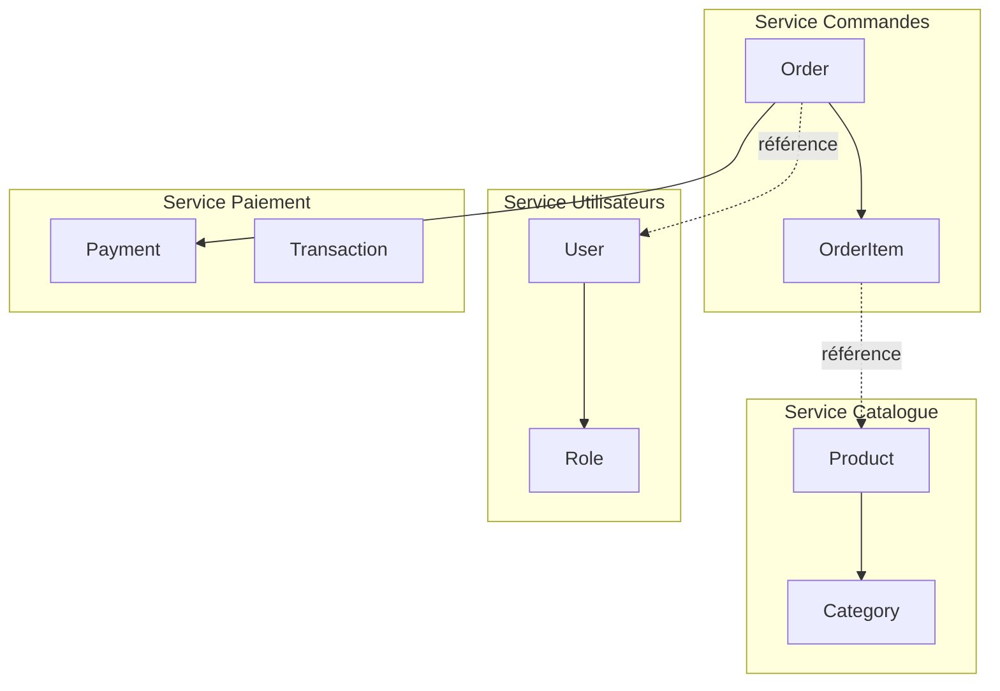
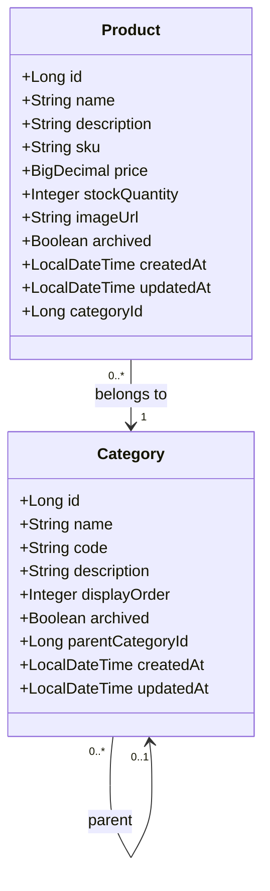
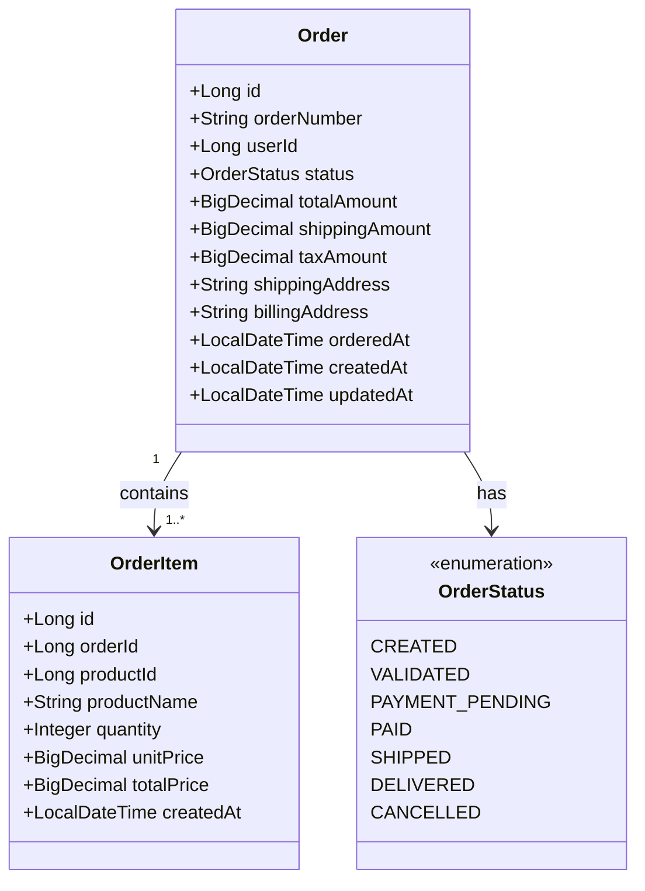
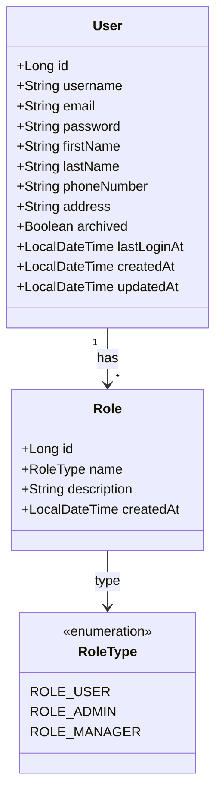
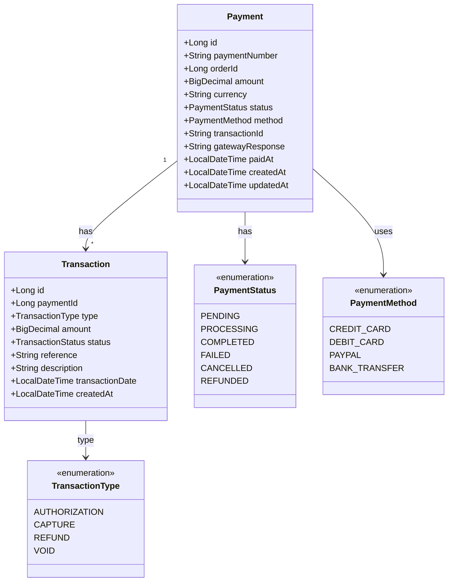

# Dictionnaire de Données - Plateforme E-Commerce

## 🎯 Vue d'ensemble

Ce document présente le modèle de données complet de la plateforme e-commerce en microservices, incluant les entités, leurs attributs, les relations et les diagrammes de classes.

---

## 🏗️ Architecture des Données

### Répartition par Service



---

## 📦 Service Catalogue

### Diagramme de Classes - Service Catalogue



### Table : `products`

| Colonne | Type | Contraintes | Description |
|---------|------|-------------|-------------|
| `id` | BIGINT | PK, AUTO_INCREMENT | Identifiant unique |
| `name` | VARCHAR(255) | NOT NULL | Nom du produit |
| `description` | TEXT | NULL | Description détaillée |
| `sku` | VARCHAR(50) | NOT NULL, UNIQUE | Stock Keeping Unit |
| `price` | DECIMAL(10,2) | NOT NULL, >= 0 | Prix unitaire |
| `stock_quantity` | INTEGER | NOT NULL, >= 0 | Quantité en stock |
| `image_url` | VARCHAR(500) | NULL | URL de l'image principale |
| `archived` | BOOLEAN | NOT NULL, DEFAULT FALSE | Produit archivé |
| `category_id` | BIGINT | FK → categories(id) | Catégorie du produit |
| `created_at` | TIMESTAMP | NOT NULL | Date de création |
| `updated_at` | TIMESTAMP | NOT NULL | Dernière modification |

**Index** :
- `idx_products_sku` sur `sku`
- `idx_products_category` sur `category_id`
- `idx_products_archived` sur `archived`
- `idx_products_name` FULLTEXT sur `name, description`

**Contraintes** :
- `ck_price_positive` : `price >= 0`
- `ck_stock_positive` : `stock_quantity >= 0`

---

### Table : `categories`

| Colonne | Type | Contraintes | Description |
|---------|------|-------------|-------------|
| `id` | BIGINT | PK, AUTO_INCREMENT | Identifiant unique |
| `name` | VARCHAR(100) | NOT NULL, UNIQUE | Nom de la catégorie |
| `code` | VARCHAR(50) | NOT NULL, UNIQUE | Code technique |
| `description` | TEXT | NULL | Description |
| `display_order` | INTEGER | NOT NULL, DEFAULT 0 | Ordre d'affichage |
| `archived` | BOOLEAN | NOT NULL, DEFAULT FALSE | Catégorie archivée |
| `parent_category_id` | BIGINT | NULL, FK → categories(id) | Catégorie parente |
| `created_at` | TIMESTAMP | NOT NULL | Date de création |
| `updated_at` | TIMESTAMP | NOT NULL | Dernière modification |

**Index** :
- `idx_categories_code` sur `code`
- `idx_categories_archived` sur `archived`
- `idx_categories_parent` sur `parent_category_id`

---

## 🛒 Service Commandes

### Diagramme de Classes - Service Commandes



### Table : `orders`

| Colonne | Type | Contraintes | Description |
|---------|------|-------------|-------------|
| `id` | BIGINT | PK, AUTO_INCREMENT | Identifiant unique |
| `order_number` | VARCHAR(50) | NOT NULL, UNIQUE | Numéro de commande |
| `user_id` | BIGINT | NOT NULL | Référence utilisateur |
| `status` | VARCHAR(20) | NOT NULL | Statut de la commande |
| `total_amount` | DECIMAL(10,2) | NOT NULL, >= 0 | Montant total |
| `shipping_amount` | DECIMAL(10,2) | NOT NULL, >= 0 | Frais de livraison |
| `tax_amount` | DECIMAL(10,2) | NOT NULL, >= 0 | Montant des taxes |
| `shipping_address` | TEXT | NOT NULL | Adresse de livraison |
| `billing_address` | TEXT | NOT NULL | Adresse de facturation |
| `ordered_at` | TIMESTAMP | NOT NULL | Date de la commande |
| `created_at` | TIMESTAMP | NOT NULL | Date de création |
| `updated_at` | TIMESTAMP | NOT NULL | Dernière modification |

**Index** :
- `idx_orders_number` sur `order_number`
- `idx_orders_user` sur `user_id`
- `idx_orders_status` sur `status`
- `idx_orders_date` sur `ordered_at`

**Contraintes** :
- `ck_total_positive` : `total_amount >= 0`
- `ck_shipping_positive` : `shipping_amount >= 0`

---

### Table : `order_items`

| Colonne | Type | Contraintes | Description |
|---------|------|-------------|-------------|
| `id` | BIGINT | PK, AUTO_INCREMENT | Identifiant unique |
| `order_id` | BIGINT | NOT NULL, FK → orders(id) | Référence commande |
| `product_id` | BIGINT | NOT NULL | Référence produit |
| `product_name` | VARCHAR(255) | NOT NULL | Nom du produit (snapshot) |
| `quantity` | INTEGER | NOT NULL, > 0 | Quantité commandée |
| `unit_price` | DECIMAL(10,2) | NOT NULL, >= 0 | Prix unitaire (snapshot) |
| `total_price` | DECIMAL(10,2) | NOT NULL, >= 0 | Prix total ligne |
| `created_at` | TIMESTAMP | NOT NULL | Date de création |

**Index** :
- `idx_order_items_order` sur `order_id`
- `idx_order_items_product` sur `product_id`

**Contraintes** :
- `ck_quantity_positive` : `quantity > 0`
- `ck_unit_price_positive` : `unit_price >= 0`
- `fk_order_items_order` : CASCADE ON DELETE

---

## 👤 Service Utilisateurs

### Diagramme de Classes - Service Utilisateurs



### Table : `users`

| Colonne | Type | Contraintes | Description |
|---------|------|-------------|-------------|
| `id` | BIGINT | PK, AUTO_INCREMENT | Identifiant unique |
| `username` | VARCHAR(50) | NOT NULL, UNIQUE | Nom d'utilisateur |
| `email` | VARCHAR(255) | NOT NULL, UNIQUE | Adresse email |
| `password` | VARCHAR(255) | NOT NULL | Mot de passe hashé (BCrypt) |
| `first_name` | VARCHAR(100) | NOT NULL | Prénom |
| `last_name` | VARCHAR(100) | NOT NULL | Nom |
| `phone_number` | VARCHAR(20) | NULL | Téléphone |
| `address` | TEXT | NULL | Adresse complète |
| `archived` | BOOLEAN | NOT NULL, DEFAULT FALSE | Compte archivé |
| `last_login_at` | TIMESTAMP | NULL | Dernière connexion |
| `created_at` | TIMESTAMP | NOT NULL | Date de création |
| `updated_at` | TIMESTAMP | NOT NULL | Dernière modification |

**Index** :
- `idx_users_username` sur `username`
- `idx_users_email` sur `email`
- `idx_users_archived` sur `archived`

**Contraintes** :
- `ck_email_format` : validation format email

---

### Table : `roles`

| Colonne | Type | Contraintes | Description |
|---------|------|-------------|-------------|
| `id` | BIGINT | PK, AUTO_INCREMENT | Identifiant unique |
| `name` | VARCHAR(50) | NOT NULL, UNIQUE | Nom du rôle |
| `description` | VARCHAR(255) | NULL | Description |
| `created_at` | TIMESTAMP | NOT NULL | Date de création |

**Valeurs par défaut** :
- `ROLE_USER` : Utilisateur standard
- `ROLE_ADMIN` : Administrateur
- `ROLE_MANAGER` : Gestionnaire (optionnel)

---

### Table : `user_roles` (Table de liaison)

| Colonne | Type | Contraintes | Description |
|---------|------|-------------|-------------|
| `user_id` | BIGINT | PK, FK → users(id) | Référence utilisateur |
| `role_id` | BIGINT | PK, FK → roles(id) | Référence rôle |

**Contraintes** :
- Clé primaire composite : (`user_id`, `role_id`)
- CASCADE ON DELETE sur les deux FK

---

## 💳 Service Paiement

### Diagramme de Classes - Service Paiement



### Table : `payments`

| Colonne | Type | Contraintes | Description |
|---------|------|-------------|-------------|
| `id` | BIGINT | PK, AUTO_INCREMENT | Identifiant unique |
| `payment_number` | VARCHAR(50) | NOT NULL, UNIQUE | Numéro de paiement |
| `order_id` | BIGINT | NOT NULL, UNIQUE | Référence commande |
| `amount` | DECIMAL(10,2) | NOT NULL, > 0 | Montant du paiement |
| `currency` | VARCHAR(3) | NOT NULL, DEFAULT 'EUR' | Code devise ISO |
| `status` | VARCHAR(20) | NOT NULL | Statut du paiement |
| `method` | VARCHAR(20) | NOT NULL | Méthode de paiement |
| `transaction_id` | VARCHAR(100) | NULL | ID transaction externe |
| `gateway_response` | TEXT | NULL | Réponse passerelle |
| `paid_at` | TIMESTAMP | NULL | Date de paiement |
| `created_at` | TIMESTAMP | NOT NULL | Date de création |
| `updated_at` | TIMESTAMP | NOT NULL | Dernière modification |

**Index** :
- `idx_payments_number` sur `payment_number`
- `idx_payments_order` sur `order_id`
- `idx_payments_status` sur `status`
- `idx_payments_transaction` sur `transaction_id`

**Contraintes** :
- `ck_amount_positive` : `amount > 0`

---

### Table : `transactions`

| Colonne | Type | Contraintes | Description |
|---------|------|-------------|-------------|
| `id` | BIGINT | PK, AUTO_INCREMENT | Identifiant unique |
| `payment_id` | BIGINT | NOT NULL, FK → payments(id) | Référence paiement |
| `type` | VARCHAR(20) | NOT NULL | Type de transaction |
| `amount` | DECIMAL(10,2) | NOT NULL, > 0 | Montant transaction |
| `status` | VARCHAR(20) | NOT NULL | Statut |
| `reference` | VARCHAR(100) | NULL, UNIQUE | Référence externe |
| `description` | TEXT | NULL | Description |
| `transaction_date` | TIMESTAMP | NOT NULL | Date transaction |
| `created_at` | TIMESTAMP | NOT NULL | Date de création |

**Index** :
- `idx_transactions_payment` sur `payment_id`
- `idx_transactions_reference` sur `reference`
- `idx_transactions_date` sur `transaction_date`

---

## 🔐 Règles de Gestion des Données

### Cohérence des Données

#### 1. Produits et Stock
- ✅ Le stock ne peut pas être négatif
- ✅ Le prix doit être supérieur ou égal à 0
- ✅ Un produit ne peut être commandé que s'il est actif
- ✅ La diminution du stock se fait de manière atomique

#### 2. Commandes
- ✅ Une commande doit avoir au moins 1 article
- ✅ Le montant total = somme(order_items.total_price) + shipping + tax
- ✅ Les transitions de statut doivent respecter le workflow
- ✅ Une commande PAID ne peut plus être modifiée

#### 3. Paiements
- ✅ Un paiement est lié à une seule commande
- ✅ Le montant du paiement = montant total de la commande
- ✅ Les transactions doivent être tracées (audit trail)
- ✅ Un remboursement ne peut pas excéder le montant payé

#### 4. Utilisateurs
- ✅ Email et username doivent être uniques
- ✅ Le mot de passe doit être hashé (BCrypt)
- ✅ Un utilisateur doit avoir au moins un rôle
- ✅ Un compte désactivé ne peut pas se connecter

---

## 🔍 Stratégies d'Indexation

### Index Critiques pour Performance

#### Service Catalogue
```sql
CREATE INDEX idx_products_search ON products(name, description);
CREATE INDEX idx_products_category_archived ON products(category_id, archived);
CREATE INDEX idx_products_price ON products(price);
```

#### Service Commandes
```sql
CREATE INDEX idx_orders_user_status ON orders(user_id, status);
CREATE INDEX idx_orders_date_range ON orders(ordered_at DESC);
CREATE INDEX idx_order_items_composite ON order_items(order_id, product_id);
```

#### Service Utilisateurs
```sql
CREATE INDEX idx_users_credentials ON users(email, archived);
CREATE UNIQUE INDEX idx_users_username_lower ON users(LOWER(username));
```

#### Service Paiement
```sql
CREATE INDEX idx_payments_order_status ON payments(order_id, status);
CREATE INDEX idx_transactions_payment_date ON transactions(payment_id, transaction_date DESC);
```

---

## 🛡️ Auditing et Traçabilité

### Champs d'Audit Standard

Toutes les tables principales incluent :

| Champ | Type | Description |
|-------|------|-------------|
| `created_at` | TIMESTAMP | Date/heure de création |
| `updated_at` | TIMESTAMP | Dernière modification |
| `created_by` | VARCHAR(100) | Utilisateur créateur (optionnel) |
| `updated_by` | VARCHAR(100) | Dernier modificateur (optionnel) |

### Tables d'Audit (Optionnel)

Pour un audit complet, ajouter des tables `*_audit` :

```sql
CREATE TABLE orders_audit (
    audit_id BIGINT PRIMARY KEY AUTO_INCREMENT,
    order_id BIGINT NOT NULL,
    action VARCHAR(20) NOT NULL, -- INSERT, UPDATE, DELETE
    old_status VARCHAR(20),
    new_status VARCHAR(20),
    changed_by VARCHAR(100),
    changed_at TIMESTAMP NOT NULL,
    change_details JSON
);
```

---

## 📚 Bonnes Pratiques

### Naming Conventions

✅ **Tables** : nom au pluriel, snake_case (`products`, `order_items`)
✅ **Colonnes** : snake_case (`first_name`, `created_at`)
✅ **FK** : `{table}_id` (`category_id`, `user_id`)
✅ **Index** : `idx_{table}_{column}` (`idx_products_category`)
✅ **Contraintes** : `ck_{table}_{description}` (`ck_price_positive`)

### Performance

✅ Utiliser des index sur les colonnes de recherche/filtrage
✅ Limiter les index (impact sur les INSERT/UPDATE)
✅ Utiliser des types de données appropriés
✅ Normaliser les données (3NF minimum)
✅ Dénormaliser si nécessaire pour la performance (snapshots)

### Sécurité

✅ Ne jamais stocker de mots de passe en clair
✅ Utiliser des types DECIMAL pour les montants financiers
✅ Implémenter des contraintes CHECK pour la validation
✅ Utiliser des transactions pour les opérations critiques
✅ Limiter les permissions des utilisateurs DB

---

## 🎯 Conclusion

Ce dictionnaire de données fournit :

- ✅ **Structure complète** des entités par service
- ✅ **Diagrammes de classes** UML détaillés
- ✅ **Schémas relationnels** avec contraintes
- ✅ **Relations inter-services** documentées
- ✅ **Règles de gestion** des données
- ✅ **Scripts de création** prêts à l'emploi

Le modèle est conçu pour être **évolutif**, **maintenable** et respecte les **bonnes pratiques** de conception de bases de données relationnelles.
