# Présentation Fonctionnelle du Projet E-Commerce

## 🎯 Vue d'ensemble

Ce document présente les aspects fonctionnels de la **Plateforme E-Commerce en Microservices**, projet fil rouge de la formation Spring Boot & Microservices.

L'objectif est de développer progressivement une plateforme e-commerce moderne, scalable et résiliente en utilisant une architecture microservices.

---

## 📋 Contexte Métier

### Problématique

Développer une plateforme e-commerce capable de :

- Gérer un catalogue de produits évolutif
- Traiter des commandes en temps réel
- Authentifier et autoriser les utilisateurs
- Assurer la disponibilité et la performance
- Faciliter la maintenance et les évolutions

### Périmètre Fonctionnel

La plateforme couvre les fonctionnalités essentielles d'un site e-commerce :

1. **Gestion du catalogue produits**
2. **Gestion des commandes**
3. **Gestion des utilisateurs et authentification**
4. **Traitement des paiements**

---

## 🏗️ Architecture Fonctionnelle

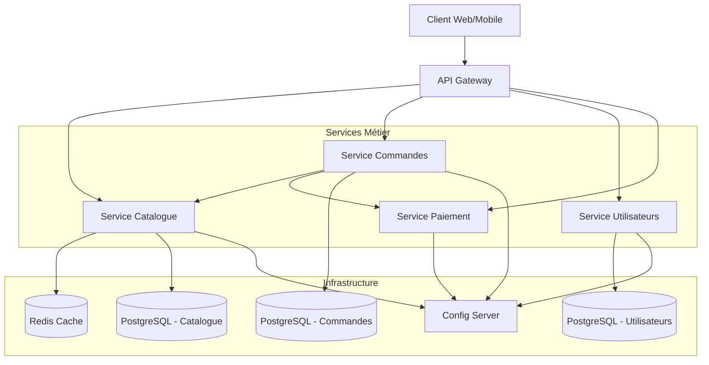

---

## 🔧 Services Fonctionnels

### 1️⃣ Service Catalogue

**Responsabilité** : Gestion du référentiel produits

**Fonctionnalités** :

- ✅ Créer, modifier, supprimer des produits
- ✅ Consulter le catalogue avec recherche et filtres
- ✅ Gérer les catégories de produits
- ✅ Gérer les stocks (quantité disponible)
- ✅ Pagination et tri des résultats

**Données gérées** :

- Informations produit (nom, description, prix)
- Images et médias
- Stock disponible
- Catégories et tags

**Endpoints principaux** :

```
GET    /api/products              # Liste/recherche produits (avec filtres optionnels)
                                  # Params: ?q=recherche&category=cat&minPrice=100&maxPrice=500
                                  #         &inStock=true&page=0&size=20&sort=name,asc
GET    /api/products/{id}         # Détail d'un produit
POST   /api/products              # Créer un produit (ADMIN)
PUT    /api/products/{id}         # Modifier un produit (ADMIN)
DELETE /api/products/{id}         # Supprimer un produit (ADMIN)
```

**Exemples d'utilisation** :

```http
# Liste complète (paginée)
GET /api/products?page=0&size=20

# Recherche textuelle
GET /api/products?q=laptop

# Filtres multiples
GET /api/products?category=electronics&minPrice=500&maxPrice=1500&inStock=true

# Recherche + filtres + tri
GET /api/products?q=laptop&category=electronics&sort=price,desc
```

---

### 2️⃣ Service Commandes

**Responsabilité** : Gestion du cycle de vie des commandes

**Fonctionnalités** :

- ✅ Créer une commande à partir d'un panier
- ✅ Valider la disponibilité des produits
- ✅ Calculer le montant total
- ✅ Suivre le statut de la commande
- ✅ Historique des commandes par utilisateur

**Workflow de commande** :

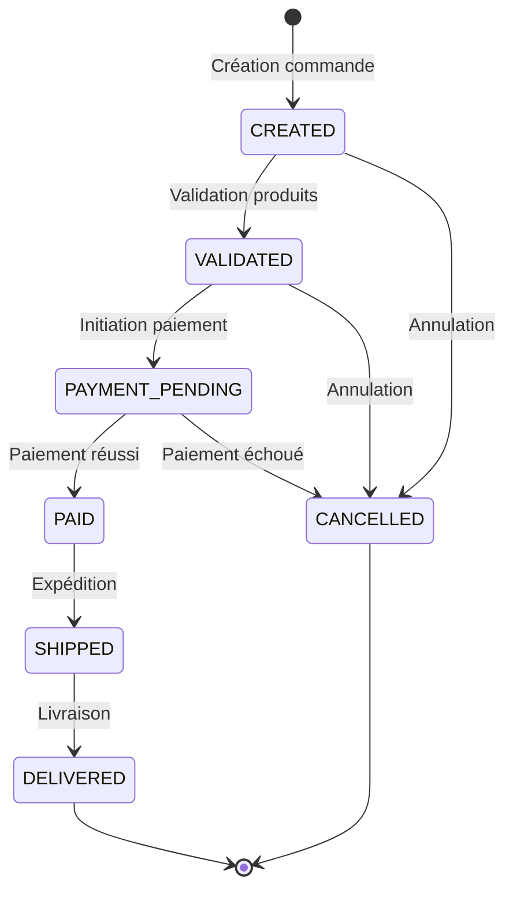

**Données gérées** :

- Commandes (date, statut, montant)
- Lignes de commande (produit, quantité, prix unitaire)
- Historique des changements de statut

**Endpoints principaux** :

```
POST   /api/orders                # Créer une commande
GET    /api/orders/{id}           # Détail d'une commande
GET    /api/orders/user/{userId}  # Commandes d'un utilisateur
PUT    /api/orders/{id}/status    # Mettre à jour le statut (ADMIN)
DELETE /api/orders/{id}           # Annuler une commande
```

---

### 3️⃣ Service Utilisateurs

**Responsabilité** : Gestion des utilisateurs et authentification

**Fonctionnalités** :

- ✅ Inscription (register)
- ✅ Authentification (login) avec JWT
- ✅ Gestion du profil utilisateur
- ✅ Gestion des rôles (USER, ADMIN)
- ✅ Récupération de mot de passe

**Flux d'authentification** :

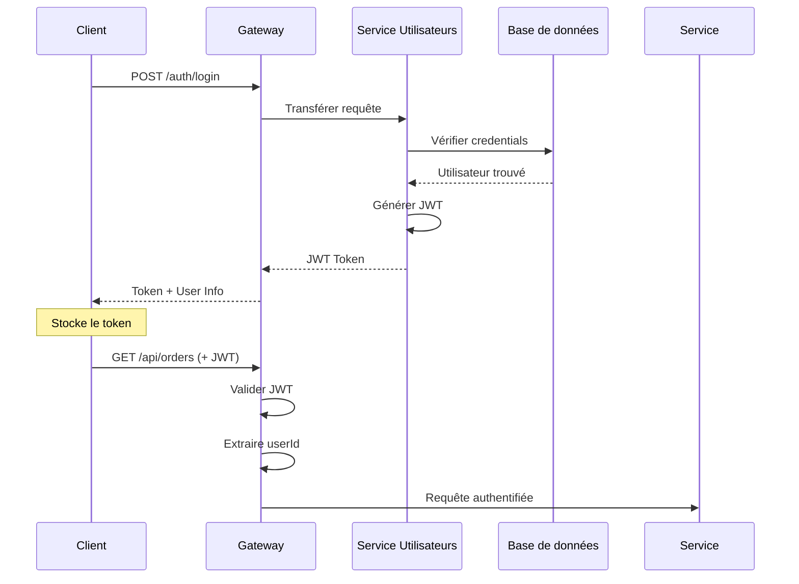

**Données gérées** :

- Informations utilisateur (nom, email, adresse)
- Credentials (mot de passe hashé)
- Rôles et permissions
- Tokens de session

**Endpoints principaux** :

```
POST   /api/auth/register         # Inscription
POST   /api/auth/login            # Connexion
GET    /api/users/me              # Profil utilisateur
PUT    /api/users/me              # Modifier profil
POST   /api/auth/refresh          # Rafraîchir token
```

---

### 4️⃣ Service Paiement

**Responsabilité** : Gestion des transactions de paiement

**Fonctionnalités** :

- ✅ Initier un paiement
- ✅ Valider une transaction
- ✅ Gérer les remboursements
- ✅ Historique des paiements

**Flux de paiement** :

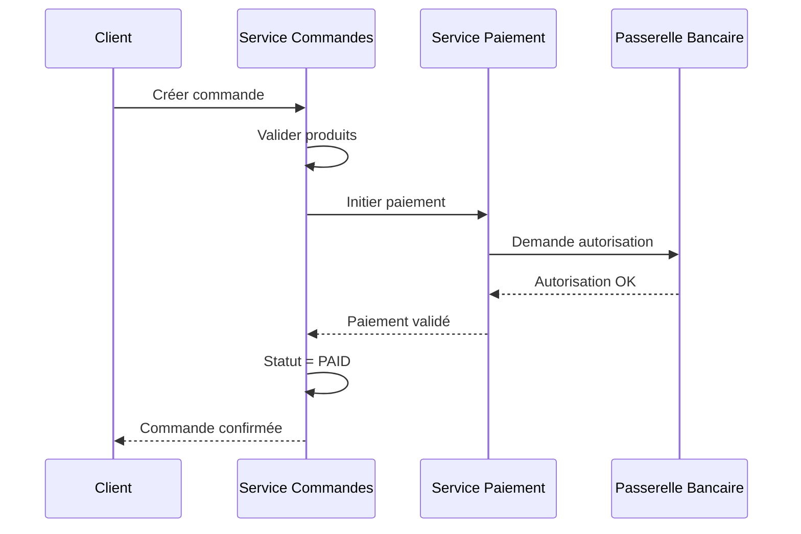

**Données gérées** :

- Transactions (montant, devise, statut)
- Références externes (transaction ID bancaire)
- Logs d'audit des paiements

**Endpoints principaux** :

```
POST   /api/payments/initiate     # Initier un paiement
GET    /api/payments/{id}         # Statut d'un paiement
POST   /api/payments/{id}/refund  # Remboursement (ADMIN)
GET    /api/payments/order/{orderId} # Paiements d'une commande
```

---

## 🔄 Flux Fonctionnels Principaux

### Flux 1 : Parcours Client - Achat Produit

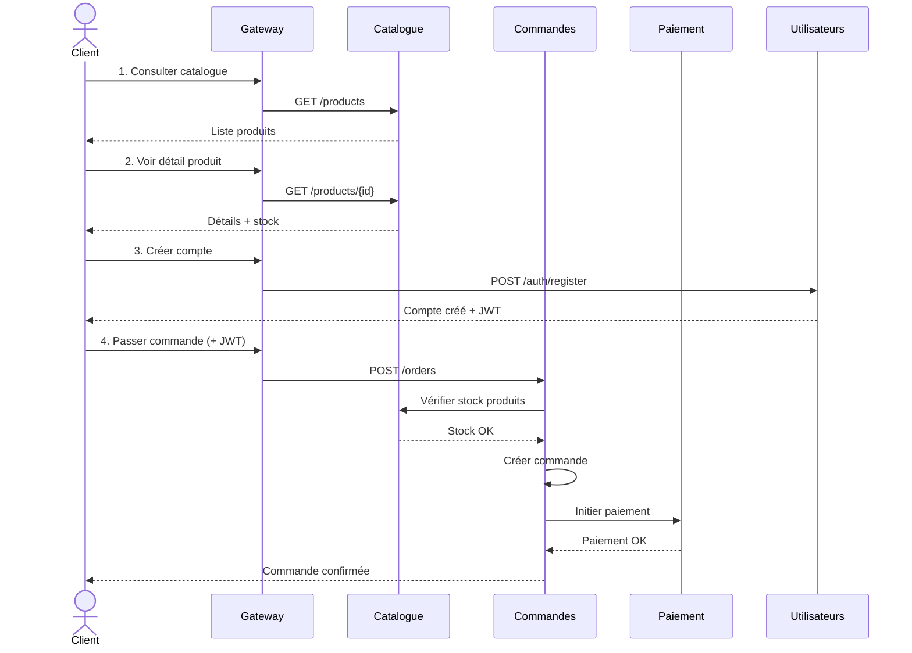

### Flux 2 : Gestion Catalogue par Admin

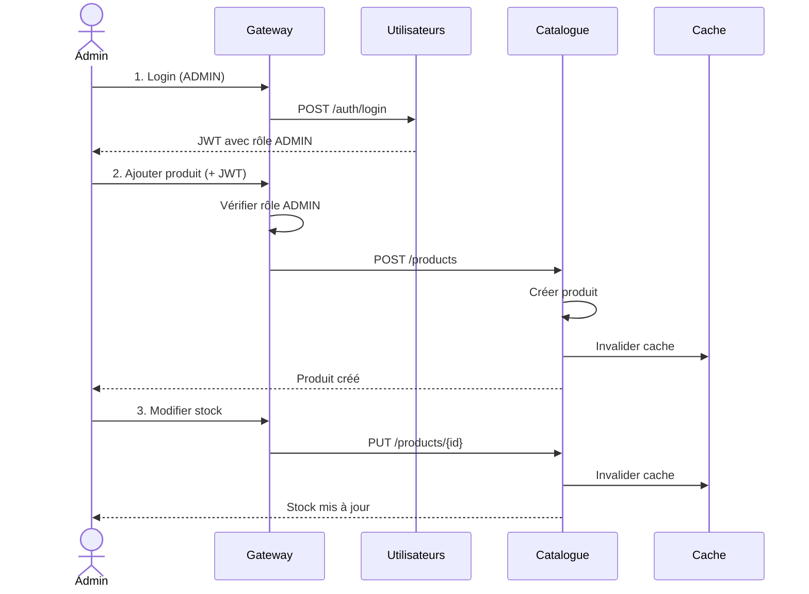

---

## 🔐 Sécurité Fonctionnelle

### Matrice des Permissions

| Fonctionnalité | Anonyme | USER | ADMIN |
|----------------|---------|------|-------|
| Consulter catalogue | ✅ | ✅ | ✅ |
| Créer compte | ✅ | ✅ | ✅ |
| Passer commande | ❌ | ✅ | ✅ |
| Voir ses commandes | ❌ | ✅ (ses commandes) | ✅ (toutes) |
| Gérer produits | ❌ | ❌ | ✅ |
| Gérer utilisateurs | ❌ | ❌ | ✅ |
| Voir tous paiements | ❌ | ❌ | ✅ |

### Mécanisme de Sécurité

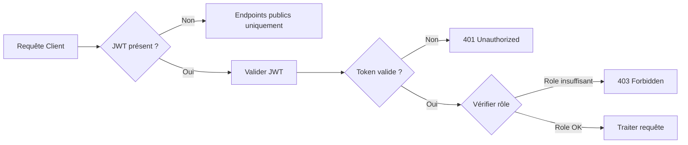

---

## 📊 Résilience et Performance

### Stratégies Mises en Œuvre

#### 1. **Cache Distribué (Redis)**

- Cache des produits consultés fréquemment
- TTL (Time To Live) : 5 minutes
- Invalidation lors de mises à jour

#### 2. **Circuit Breaker**

- Protection des appels inter-services
- Fallback en cas de service indisponible
- Exemple : Si Service Catalogue down → afficher commandes sans détails produits

#### 3. **Retry et Timeout**

- Retry automatique (max 3 tentatives)
- Timeout configuré : 5 secondes
- Backoff exponentiel

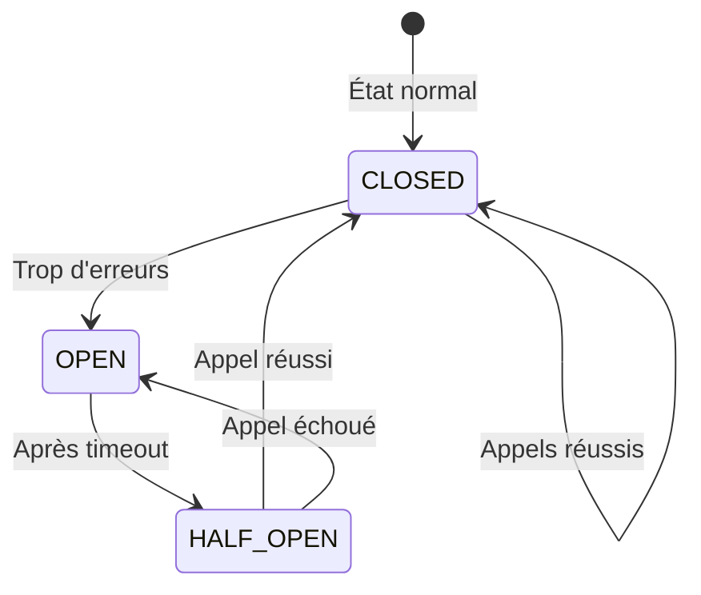

---

## 🚀 Évolutivité

### Scalabilité Horizontale

Chaque service peut être scalé indépendamment :

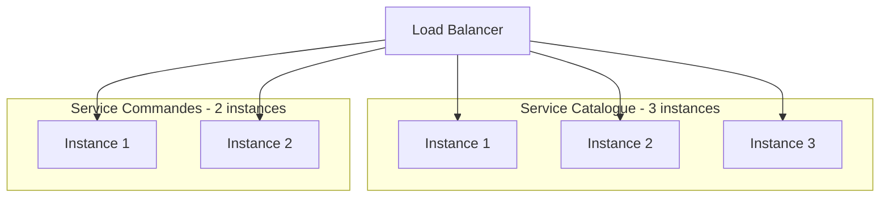

### Métriques de Performance Attendues

| Métrique | Objectif |
|----------|----------|
| Temps de réponse (GET) | < 200ms |
| Temps de réponse (POST) | < 500ms |
| Disponibilité | > 99.5% |
| Throughput | > 1000 req/s |

---

## 📈 Monitoring et Observabilité

### Logs Structurés

Chaque requête est tracée avec :

- Request ID unique
- Timestamp
- Service source
- Niveau de log (INFO, WARN, ERROR)
- Contexte métier

Exemple :

```
[2025-11-09 10:15:32] INFO [order-service] [req-id: abc123] 
Order created: orderId=1001, userId=42, amount=99.99€
```

### Points de Contrôle

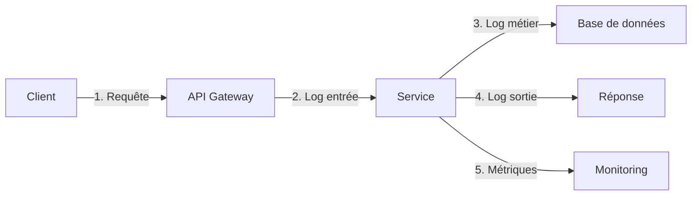

---

## 🎓 Progression du Projet

Le projet est construit progressivement sur 12 modules :

```mermaid
gantt
    title Évolution du Projet E-Commerce
    dateFormat X
    axisFormat %s
    
    section Fondations
    Setup & Java Moderne :done, 0, 5
    
    section Services
    Service Catalogue :done, 5, 8
    Documentation & Erreurs :done, 13, 4
    Base de données :done, 17, 5
    Service Commandes :done, 22, 7
    
    section Qualité
    Logging :done, 29, 3
    Tests Automatisés :done, 32, 6
    
    section Sécurité
    Spring Security & JWT :done, 38, 6
    
    section Infrastructure
    Docker :done, 44, 5
    Config Centralisée :done, 49, 4
    Cache & Résilience :done, 53, 4
    
    section Finalisation
    Intégration & Déploiement :done, 57, 3
```

---

## 📦 Livrables Finaux

À l'issue de la formation, la plateforme comprend :

### Fonctionnalités Opérationnelles

- ✅ **Catalogue produits** : CRUD complet avec recherche
- ✅ **Système de commandes** : Workflow complet
- ✅ **Authentification JWT** : Sécurisation des endpoints
- ✅ **Paiement simulé** : Intégration basique
- ✅ **API Gateway** : Point d'entrée unique
- ✅ **Cache distribué** : Optimisation performance
- ✅ **Configuration centralisée** : Gestion multi-environnements

### Documentation Technique

- 📄 Documentation API Swagger
- 📐 Schémas d'architecture
- 📋 Instructions de déploiement
- 🧪 Documentation des tests

### Infrastructure

- 🐳 Images Docker pour chaque service
- 🔧 Docker Compose pour orchestration locale
- ⚙️ Configuration pour dev, test, prod
- 🔐 Gestion des secrets et variables d'environnement

---

## 🎯 Cas d'Usage Couverts

### En tant que Client

1. **Découvrir les produits** sans compte
2. **Créer un compte** pour passer commande
3. **Ajouter au panier** et valider une commande
4. **Payer en ligne** de manière sécurisée
5. **Suivre mes commandes** et leur statut
6. **Consulter l'historique** de mes achats

### En tant qu'Administrateur

1. **Gérer le catalogue** (CRUD produits)
2. **Gérer les stocks** en temps réel
3. **Voir toutes les commandes** en cours
4. **Modifier le statut** des commandes
5. **Consulter les paiements** et effectuer des remboursements
6. **Gérer les utilisateurs** et leurs rôles

---

## 🔮 Évolutions Possibles

### Phase 2 (Non inclus dans la formation)

- Service de notification (emails)
- Gestion des avis et notes produits
- Système de promotions et coupons
- Recommendations personnalisées
- Gestion de panier persistant
- Wishlist

### Améliorations Techniques

- Kubernetes pour l'orchestration
- Service mesh (Istio)
- Event-driven architecture avec Kafka
- Observabilité complète (Grafana, Prometheus)
- CI/CD complet (Jenkins/GitLab CI)

---

## 📚 Conclusion

Cette plateforme e-commerce microservices constitue un **projet pédagogique complet** qui couvre :

- ✅ Les patterns d'architecture microservices
- ✅ Les bonnes pratiques Spring Boot
- ✅ La sécurité applicative moderne
- ✅ La résilience et la performance
- ✅ Les tests automatisés
- ✅ La conteneurisation et le déploiement

Le projet est **évolutif** et **modulaire**, permettant aux apprenants de comprendre progressivement les enjeux d'une architecture distribuée moderne.
