# Stack Technique du Projet E-Commerce

## 🎯 Vue d'ensemble

Ce document présente l'ensemble des technologies, frameworks et outils utilisés dans le projet de plateforme e-commerce en microservices.

---

## ☕ Backend - Core

### Java & Frameworks

| Technologie | Version | Usage | Module |
|-------------|---------|-------|--------|
| **Java** | 21+ | Langage principal | Tous |
| **Spring Boot** | 3.x | Framework application | Tous les services |
| **Spring Web** | 3.x | API REST | Tous les services |
| **Spring Data JPA** | 3.x | Accès données | Catalogue, Commandes, Utilisateurs |
| **Spring Security** | 3.x | Sécurité & authentification | Tous les services |
| **Spring Cloud Config** | 4.x | Configuration centralisée | Config Server + Services |
| **Spring Cloud OpenFeign** | 4.x | Communication inter-services | Service Commandes |

### Bibliothèques Java

| Bibliothèque | Version | Usage | Module |
|--------------|---------|-------|--------|
| **Lombok** | 1.18.x | Réduction boilerplate | Module 1 - Tous |
| **MapStruct** | 1.5.x | Mapping DTO ↔ Entity | Module 3 - Tous |
| **Resilience4j** | 2.x | Circuit Breaker, Retry | Module 11 |
| **JJWT** | 0.12.x | Gestion tokens JWT | Module 8 - Service Utilisateurs |

---

## 🗄️ Base de Données

### SGBD

| Technologie | Version | Usage | Module |
|-------------|---------|-------|--------|
| **PostgreSQL** | 16+ | Base de données production | Module 4 - Tous les services |
| **H2 Database** | 2.x | Base en mémoire (dev/tests) | Module 2 - Tests |

### Migration & ORM

| Technologie | Version | Usage | Module |
|-------------|---------|-------|--------|
| **Liquibase** | 4.x | Gestion migrations DB | Module 4 |
| **Hibernate** | 6.x | ORM (via Spring Data JPA) | Tous |
| **HikariCP** | 5.x | Connection pooling | Tous (intégré Spring Boot) |

---

## 🚀 Cache & Performance

| Technologie | Version | Usage | Module |
|-------------|---------|-------|--------|
| **Redis** | 7.x | Cache distribué | Module 11 - Service Catalogue |
| **Spring Cache** | 3.x | Abstraction cache | Module 11 |
| **Lettuce** | 6.x | Client Redis | Module 11 |

---

## 📝 Documentation & Validation

| Technologie | Version | Usage | Module |
|-------------|---------|-------|--------|
| **SpringDoc OpenAPI** | 2.x | Documentation API Swagger | Module 3 - Tous |
| **Swagger UI** | - | Interface doc interactive | Module 3 - Tous |
| **Jakarta Bean Validation** | 3.x | Validation des données | Module 5 - Tous |

---

## 🧪 Tests

### Frameworks de Tests

| Technologie | Version | Usage | Module |
|-------------|---------|-------|--------|
| **JUnit 5 (Jupiter)** | 5.x | Framework de tests | Module 7 - Tous |
| **Mockito** | 5.x | Mocking pour tests unitaires | Module 7 - Tous |
| **AssertJ** | 3.x | Assertions fluides | Module 7 - Tous |
| **Spring Boot Test** | 3.x | Tests d'intégration | Module 7 - Tous |
| **MockMvc** | 3.x | Tests contrôleurs REST | Module 7 - Tous |
| **TestContainers** | 1.19.x | Tests avec conteneurs Docker | Module 7 - Tests d'intégration |

### Qualité de Code

| Technologie | Version | Usage | Module |
|-------------|---------|-------|--------|
| **JaCoCo** | 0.8.x | Couverture de code | Module 7 |
| **SonarQube** | - | Analyse qualité code (optionnel) | - |

---

## 🐳 Conteneurisation & Orchestration

| Technologie | Version | Usage | Module |
|-------------|---------|-------|--------|
| **Docker** | 24.x+ | Conteneurisation | Module 9 |
| **Docker Compose** | 2.x+ | Orchestration locale | Module 9 |
| **Dockerfile** | - | Multi-stage builds | Module 9 |

---

## 🔧 Build & Gestion de Dépendances

| Technologie | Version | Usage | Module |
|-------------|---------|-------|--------|
| **Maven** | 3.9.x+ | Build & gestion dépendances | Module 1 - Tous |
| **Maven Wrapper** | - | Version Maven embarquée | Module 1 |
| **Spring Boot Maven Plugin** | 3.x | Packaging exécutable | Tous |

---

## 🔐 Sécurité

| Technologie | Version | Usage | Module |
|-------------|---------|-------|--------|
| **Spring Security** | 6.x | Framework sécurité | Module 8 |
| **JWT (JSON Web Token)** | - | Authentification stateless | Module 8 |
| **BCrypt** | - | Hashage mots de passe | Module 8 |
| **HTTPS/TLS** | - | Chiffrement communication | Production |

---

## 📊 Logging & Monitoring

### Logging

| Technologie | Version | Usage | Module |
|-------------|---------|-------|--------|
| **SLF4J** | 2.x | API de logging | Module 6 - Tous |
| **Logback** | 1.4.x | Implémentation logging | Module 6 - Tous |
| **Logstash Encoder** | 7.x | Format logs JSON | Module 6 (optionnel) |

### Monitoring (Optionnel - Non inclus dans formation)

| Technologie | Version | Usage |
|-------------|---------|-------|
| **Actuator** | 3.x | Endpoints métriques |
| **Prometheus** | 2.x | Collecte métriques |
| **Grafana** | 10.x | Visualisation |
| **ELK Stack** | 8.x | Centralisation logs |

---

## 🌐 API Gateway & Service Mesh

| Technologie | Version | Usage | Module |
|-------------|---------|-------|--------|
| **Spring Cloud Gateway** | 4.x | API Gateway | Module 12 |
| **Netflix Eureka** | - | Service Discovery (optionnel) | - |

---

## 🛠️ Outils de Développement

### IDE & Éditeurs

| Outil | Version | Usage |
|-------|---------|-------|
| **IntelliJ IDEA** | 2024.x+ | IDE recommandé |
| **VS Code** | 1.x+ | Éditeur alternatif |
| **Eclipse** | 2023.x+ | IDE alternatif |

### Extensions IDE Recommandées

#### IntelliJ IDEA

- Lombok Plugin
- Spring Boot Assistant
- Docker Plugin
- Database Navigator

#### VS Code

- Extension Pack for Java
- Spring Boot Extension Pack
- Docker
- REST Client

---

## 🔄 Intégration Continue (Optionnel)

| Technologie | Usage |
|-------------|-------|
| **GitHub Actions** | CI/CD pipeline |
| **GitLab CI** | CI/CD alternatif |
| **Jenkins** | CI/CD traditionnel |

---

## 🏗️ Architecture de Déploiement

### Environnement de Développement

```mermaid
graph TB
    Dev[Développeur Local]
    
    subgraph "Docker Compose"
        Services[Services Spring Boot]
        PG[(PostgreSQL)]
        Redis[(Redis)]
        Config[Config Server]
    end
    
    Dev --> Services
    Services --> PG
    Services --> Redis
    Services --> Config
```



### Environnement de Production (Cible)


---

## 🎓 Progression de la Stack par Module

| Module | Technologies Introduites |
|--------|-------------------------|
| **Module 1** | Java 17, Maven, Lombok, Streams API |
| **Module 2** | Spring Boot, Spring Web, JPA, H2, REST |
| **Module 3** | Swagger/OpenAPI, MapStruct, Exception Handling |
| **Module 4** | PostgreSQL, Liquibase, Auditing |
| **Module 5** | OpenFeign, Pagination, Bean Validation |
| **Module 6** | Logback, SLF4J |
| **Module 7** | JUnit 5, Mockito, MockMvc, TestContainers |
| **Module 8** | Spring Security, JWT, BCrypt |
| **Module 9** | Docker, Docker Compose, Multi-stage builds |
| **Module 10** | Spring Cloud Config, Profiles |
| **Module 11** | Redis, Spring Cache, Resilience4j |
| **Module 12** | Spring Cloud Gateway, Intégration finale |

---

## 🔗 Ressources & Documentation

### Documentation Officielle

| Technologie | Lien |
|-------------|------|
| Spring Boot | <https://spring.io/projects/spring-boot> |
| Spring Cloud | <https://spring.io/projects/spring-cloud> |
| Spring Security | <https://spring.io/projects/spring-security> |
| PostgreSQL | <https://www.postgresql.org/docs/> |
| Redis | <https://redis.io/documentation> |
| Docker | <https://docs.docker.com/> |
| Liquibase | <https://docs.liquibase.com/> |
| TestContainers | <https://testcontainers.com/> |

### Guides & Tutoriels

- [Spring Boot Reference Guide](https://docs.spring.io/spring-boot/docs/current/reference/html/)
- [Baeldung - Spring Tutorials](https://www.baeldung.com/spring-tutorial)

---

## 📋 Prérequis Installation

### Développement Local

```bash
# Java 17+
java -version

# Maven 3.9+
mvn -version

# Docker Desktop
docker --version

# PostgreSQL (via Docker ou local)
psql --version

# Redis (via Docker ou local)
redis-cli --version

# Git
git --version
```

### Variables d'Environnement Recommandées

```bash
# Java
export JAVA_HOME=/path/to/jdk-17
export PATH=$JAVA_HOME/bin:$PATH

# Maven
export MAVEN_HOME=/path/to/maven
export PATH=$MAVEN_HOME/bin:$PATH

# Docker (si nécessaire)
export DOCKER_HOST=unix:///var/run/docker.sock
```

---

## 💡 Bonnes Pratiques

### Gestion des Versions

- ✅ Utiliser Spring Boot BOM pour gérer les versions
- ✅ Définir les versions dans `<properties>` du POM parent
- ✅ Éviter les versions SNAPSHOT en production
- ✅ Tester les mises à jour dans un environnement dédié

### Sécurité

- ✅ Toujours utiliser les dernières versions de sécurité
- ✅ Scanner régulièrement les dépendances (Maven Dependency Check)
- ✅ Externaliser les credentials (jamais dans le code)
- ✅ Utiliser des variables d'environnement pour les secrets

### Performance

- ✅ Activer le cache L2 Hibernate si nécessaire
- ✅ Configurer correctement le pool de connexions
- ✅ Utiliser des index sur les colonnes fréquemment requêtées
- ✅ Implémenter le cache distribué pour les données statiques

---

## 🚀 Commandes Utiles

### Maven

```bash
# Compiler le projet
mvn clean compile

# Lancer les tests
mvn test

# Package (JAR)
mvn clean package

# Skip tests
mvn clean package -DskipTests

# Lancer l'application
mvn spring-boot:run

# Vérifier les dépendances
mvn dependency:tree
```

### Docker

```bash
# Build image
docker build -t catalogue-service:latest .

# Démarrer tous les services
docker compose up -d

# Voir les logs
docker compose logs -f catalogue-service

# Arrêter tous les services
docker compose down

# Rebuild et redémarrer
docker compose up -d --build
```

### PostgreSQL

```bash
# Se connecter à la base
psql -h localhost -U postgres -d ecommerce

# Lister les bases
\l

# Lister les tables
\dt

# Décrire une table
\d products
```

### Redis

```bash
# Se connecter au serveur Redis
redis-cli

# Lister toutes les clés
KEYS *

# Voir une valeur
GET product:1

# Vider le cache
FLUSHALL
```

---

## 📚 Conclusion

Cette stack technique moderne et complète permet de :

- ✅ Développer des microservices robustes et scalables
- ✅ Assurer la sécurité et la résilience des applications
- ✅ Faciliter les tests et le déploiement
- ✅ Suivre les meilleures pratiques de l'industrie

La stack évolue progressivement au fil des modules, permettant aux apprenants d'acquérir les compétences de manière incrémentale et pratique.
